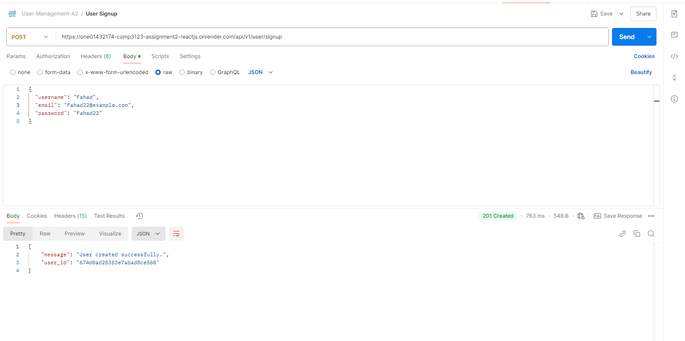

# Employee Management System

## Overview
The Employee Management System is a full-stack web application designed to manage employee records efficiently. The application allows users to perform CRUD (Create, Read, Update, Delete) operations on employee data and includes a secure user authentication system.

The project is developed using:

- **Frontend**: React.js
- **Backend**: Node.js, Express.js
- **Database**: MongoDB
- **Deployment**: Render (for both backend and frontend)

## Features

### User Features:
- **Signup**: Create a new user account.
- **Login**: Authenticate using credentials to access the system.
- **Logout**: Securely log out of the application.

### Employee Management Features:
- **Add Employee**: Create new employee records with required details.
- **View Employee**: View details of individual employees.
- **Update Employee**: Modify employee information.
- **Delete Employee**: Remove employees from the system.
- **List All Employees**: View a table displaying all employees.

## Technologies Used

### Frontend:
- **React.js**: For building the user interface.
- **Axios**: To make API requests to the backend.
- **CSS**: For styling the UI.

### Backend:
- **Node.js**: JavaScript runtime for building the server-side application.
- **Express.js**: Framework for handling API routes and middleware.
- **CORS**: Middleware for enabling Cross-Origin Resource Sharing (CORS) between the frontend and backend.
- **Mongoose**: For MongoDB object modeling and data validation.

### Database:
- **MongoDB**: NoSQL database for storing user and employee data.

## Deployment

### Frontend:
Deployed on Render: [Frontend URL](https://one01432174-comp3123-assignment2-reactjs-pe0g.onrender.com)

### Backend:
Deployed on Render: [Backend URL](https://one01432174-comp3123-assignment2-reactjs.onrender.com)

## Screenshots

### MongoDB

### Backend

#### REST API Tests with Postman
- **User Signup:**  
  

- **User Login:**  
  

- **Employees List:**  
  

- **Add Employee:**  
  

- **Update Employee Details:**  
  

- **View Employee:**  
  

- **Delete Employee:**  
  

### Frontend

#### Login Screen

#### Signup Screen

#### Employees List

#### Add New Employee

#### Update Employee
  

#### View Employee

#### Search Employee
  
  

#### Delete Employee
  
  

#### Logout

### Validation and Error Handling
  
  
  
